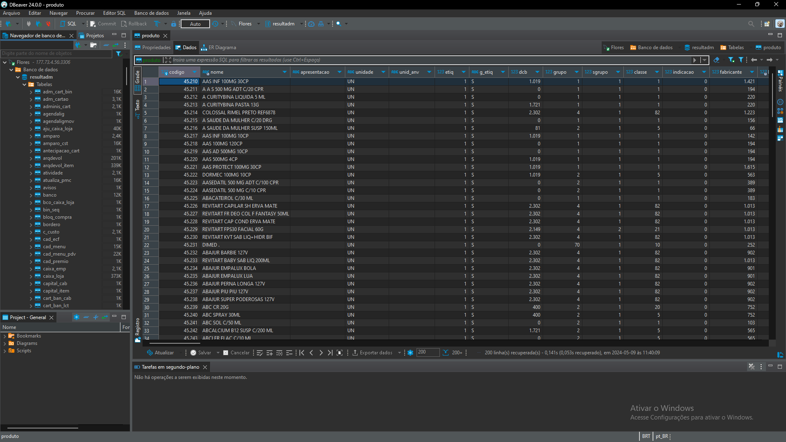
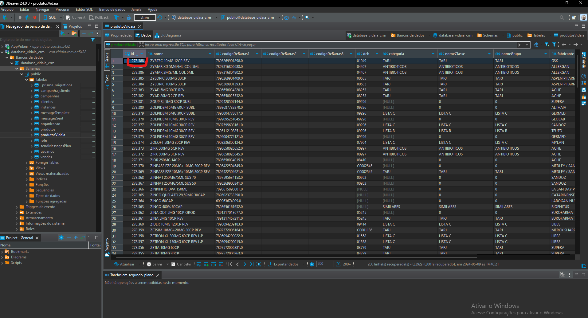

## Integração com a TRIER - lambda functions

Essa aplicação resolveu o problema de integração com clientes que utilizam o **<a href='https://triersistemas.com.br/?gad_source=1&gclid=CjwKCAiA6t-6BhA3EiwAltRFGOdYZhulFdY-30uQCrFWNRx4oONkGO_z6abSxsWVmkebeifzcz57ThoCPp4QAvD_BwE'>TRIER</a> ERP**, onde antes da solução era necessário fazer a conexão remotamente ao computador do cliente, exportar todos os relatórios manualmente, processá-los e subir para o banco, agora temos uma API direta da trier onde o python consome, faz todos os processamentos necessários e sobe para o banco, esse script roda diariamente no **<a href='https://aws.amazon.com/pt/pm/lambda/?gclid=CjwKCAiA6t-6BhA3EiwAltRFGBwC-XIXzETxYu-MC2FfAjPDKrvYBPbcbSFeDb5If4olhrCAgUhYcxoCxc4QAvD_BwE&trk=56f58804-91cd-4af4-98d4-afe277a57fd3&sc_channel=ps&ef_id=CjwKCAiA6t-6BhA3EiwAltRFGBwC-XIXzETxYu-MC2FfAjPDKrvYBPbcbSFeDb5If4olhrCAgUhYcxoCxc4QAvD_BwE:G:s&s_kwcid=AL!4422!3!651510591822!e!!g!!aws%20lambda!19828231347!148480170233'>aws lambda</a>**

A estrutura de pastas foi feita da seguinte forma:
```CMD
📂 - LAMBDA
📄 - lambda_function.py (arquivo principal que chama todas as funções)
📂 - utils
    |📄 - arrumar_json_itens.py (corrige o formato que vem os dados)
    |📄 - numero_telefone.py (corrige o telefone para o formato (DDI) DDD + X XXXX-XXXX)
    |📄 - TRIER.py (Arquivo "principal" onde são feitas as requisições para a TRIER, juntamente com as tratativas para os dados)
    |📄 - ultima_compra.py (Pega o último registro de compra de um cliente)
🐋 - Dockerfile
📄 - requirements.txt (bibliotecas necessárias)
```

### TRIER

> Acesse a [documentação oficial](https://homologacao.triersistemas.com.br/api-sgf/#) para mais informações sobre a integração.

Para acessar a API da trier, é necessário entrar em contato com a empresa solicitando um token de acesso para o cliente desejado, após isso, basta importar o <a href='https://homologacao.triersistemas.com.br/api-sgf/postman-api-integracao-trier-1.5.4.json'>arquivo de requisições</a> no postman (ou em algum serviço parecido) e testar a conexão.

Para rodar o arquivo principal, antes é necessário criar um arquivo com variáveis de ambiente, seguindo o exemplo abaixo:

```CMD
URL_CLIENTE_API: (/cliente/obter-todos-v1)
URL_PRODUTO_API:  (/produto/obter-todos-v1)
URL_VENDA_API: (/venda/obter-v1)

QTD_REGISTROS: (numero máximo é "999")
API_TOKEN_CONCEITO: (token da farmácia conceito (disponibilizado pela TRIER))
API_TOKEN_FARMAXI: (token da farmácia farmaxo (disponibilizado pela TRIER))
API_TOKEN_PORTAO: (token da farmácia portão (disponibilizado pela TRIER))

# link para o banco do X
host_X: 
port_X:  
database_X:  
user_X:  
password_X:  

# link para o banco do CRM
host_crm:  
port_crm:  
database_crm:  
user_crm:
password_crm:  
```

---

## Demais integrações
> A documentação a seguir foi reaproveitada de um projeto antigo que integrava a vidaia a outros ERP's.

##### DIFERENTES SISTEMAS
<p style="text-align: justify;">
Atualmente temos 4 ERP's principais encontradas em nossos clientes:
</p>

- SPA
- TRIER
- SYSFAR
- LINX

<p style="text-align: justify;">
A aplicação busca viabilizar a automatização desse fluxo de extração e inserção sem depender de um esforço humano, por mais que em uma pequena parte desse fluxo seja exigida um pré-processamento nos arquivos .XLSX, mas é algo que pode ser melhorado posteriormente. A seguir você encontrará um pequeno review sobre cada ERP com suas qualidades de dificuldades, pode ser que nesse momento seja meio dificil de entender, mas ao final desse documento espero sanado as lacunas que ficarão ao decorrer dele.
</p>

<h4> COMO A EXTRAÇÃO É FEITA HOJE?</h4>

Cada cliente tem em sua máquina um programa chamado Parsec, mas que poderia ser qualquer outro desde que permita o acesso remoto e o controle do mouse e teclado. O motivo da escolha do parsec foi a facilidade, o programa é bem intuitivo, não houve dificuldade por parte dos clientes em liberar o acesso a máquina, temos um vídeo tuturial de como instalar o parsec e logar na conta da vidaia, basta clicar [aqui](https://www.youtube.com/watch?v=PehEtd4CqS4) para assistir.


<h4> MAPEAMENTO DOS ERP'S </h4>

**SPA:** Atualmente é o ERP de maior facilidade, temos acesso direto ao SQL do cliente, possibilitando a extração de dados através de um SELECT simples às tabelas *clientes*, *produtos* e a view *vendas_ger*. Felizmente temos 2 clientes que utilizam esse sistema, são eles *Flores* e *Nostra Farma*.

<blockquote style="background-color: rgba(255, 255, 0, 0.8); color: black; padding: 10px; border-radius: 10px;">
    <b>ATENÇÃO: O BANCO DA FLORES ESTÁ LIBERADO SOMENTE PARA A NOSSA MÁQUINA EC2, SENDO ASSIM, A EXTRAÇÃO FOI FEITA MANUALMENTE E COLOCADA NA SUA DEVIDA PASTA DENTRO DE "DATA", UMA IMPLEMENTAÇÃO FUTURA SERIA ESSE SSH DIRETO NO CÓDIGO
</blockquote>



**SYSFAR:** De longe o nosso sistema mais problemático, relatórios sem relação, muita dificuldade em estruturar e subir tudo.

[clientes](https://docs.google.com/spreadsheets/d/1PC8D5aJXnnmHw97-kEwq_UO65b_OpFozPVpcdRV3TwU/edit?usp=sharing) - Dentre as exigidas, clientes é a mais normal, apresenta tudo o que a gente precisa.

[produtos (código de barras)](https://docs.google.com/spreadsheets/d/11KNdvFWhCPYPLJEkep4MjBsyM6tUwSBG2UZftyZ7NV0/edit?usp=sharing) - É um arquivo o nome e o código de barras do produto para realizar o merge com a tabela de produtos (que por alguma razão não possui o código de barras)

[produtos](https://docs.google.com/spreadsheets/d/1gGLyWQSNbPjXiaOsUPJjI-Js0vjsypW8Bi0NwCJtBR8/edit?usp=sharing) - Aqui você contra todas as informações sobre os produtos, o único processamento foi adicionar o nome das colunas e uma pequena correção no alinhamento delas, você pode comparar as alterações observando a primeira e a última página.

[vendas]() - Foi o principal problema encontrado, realizamos a extração de uma tabela que aparentava ser as vendas diárias, realmente era, mas não tinha um código de relação entre clientes e o número de venda considerado foi a coluna **NF**, realizei uma nova conexão no computador da cliente para tentar encontrar uma tabela de vendas que suprisse as necessidades, mas sem sucesso, contatamos o suporte e para ter acesso direto ao BD, estamos aguardando o retorno.

**LINX:** O ERP do cliente disponibilizou um usuário com permissão de consulta ao banco de dados, mas sem nenhum tipo de suporte referente ao significado das centenas de tabelas, realizamos a extração naquelas que julgamos útil. O lado bom é que nenhum pré-processamento foi necessário, basta jogar na pasta de dados da cia da saúde que o script funciona-rá.
[cliente](https://docs.google.com/spreadsheets/d/15RoZ2hFya3zOpH_I-Ws6wtJz0OzbC7ktST9c1SwdMRU/edit?usp=sharing) - Cadcli, parece meio estranha abrindo pelo sheets, mas é só trocar o separador no python que ele abre certinho. 

[produtos](https://docs.google.com/spreadsheets/d/1Bi65r3m1isPUGw0OhdBNU2QvsmApxixCI1I8LG5x79k/edit?usp=sharing) - Estcad, tudo certinho, sem modificações.

[vendas](https://docs.google.com/spreadsheets/d/1HLqC07oTqUdoantqjGgKApXSoLjxWfSSTCbcP14xPs4/edit?usp=sharing) - Estped, uma das tabelas de vendas, sem modificações, apenas um merge com a outra tabela de vendas.

[vendas2](https://docs.google.com/spreadsheets/d/1zE5ZtbkehvIAv4VIzMJG1yjV959bK3DntvwhBnXSm1M/edit?usp=sharing) - Estped1, outra tabela com vendas, fizemos a junção com a tabela de cima.


<h4>SOBRE O CÓDIGO</h4>

<p style="text-align: justify;">
Na pasta root do projeto temos 3 arquivos principais, são eles *main.py*, *strategy.py* e *.env (apagado devido ao gitgnore)*. O programa foi todo desenvolvido em python adotando o design pattern Strategy que pode não está perfeito pois essa foi uma das primeiras vezes
 Começando pelo mais simples, o **.env** armazena as credenciais do banco da *flores*, *nostra farma* e do banco CRM da *vidaia*, deve ser recriado do seguinte formato:
</p>

 ```python
    user_flores = ''
    password_flores = ''
    host_flores = ''
    database_flores = ''
    port_flores = ''

    user_nostrafarma = ''
    password_nostrafarma = ''
    host_nostrafarma = ''
    database_nostrafarma = ''
    port_nostrafarma = ''

    host_vidaia = ''
    port_vidaia = ''
    database_vidaia = ''
    user_vidaia = ''
    password_vidaia = ''
 ```

<p style="text-align: justify;">
 Abrindo o arquivo <i style="color: #0000FF">main.py</i>, podemos ver que há um <b>try</b> para cada cliente, essa parte ainda está bem desorganizada, mas por lá é possível verificar o tratamento individual relacionado a cada cliente antes de rodar o script.
 No <i style="color: #0000FF">strategy.py</i> você encontrará uma classe para cada ERP seguido das funções para o tratamento de cada tipo de dado, no final, teremos os seguintes dataframes para cada ERP:
</p>
<br>

<h6>Clientes</h6>
<p style="text-align: justify;">
para cada cliente é um tratamento diferente, acessando a classe de cada ERP é possível observar mudanças como: tipo de dado, tratamento de nulos, substituições feitas em strings, tratamento para o número de telefone, tratamento para a última compra etc, o dataframe final deve seguir o seguinte formato para todos os ERP's: 
</p>

 ```python
dfClientes = pd.DataFrame({
    "usuarioId" : self.usuario_id,
    "telefone" : self.consulta_clientes[''],
    "telefone2" : self.consulta_clientes[''],
    "telefone3" : self.consulta_clientes[''],
    "nome" : self.consulta_clientes[''],
    "cpf" : self.consulta_clientes[''],
    "endereco": self.consulta_clientes[''],
    "CEP": self.consulta_clientes[''],
    "numero": self.consulta_clientes[''],
    "codigoCliente" : self.consulta_clientes[''],
    "ultimaCompra" : self.consulta_clientes[''],
    "dataNascimento" : self.consulta_clientes[''],
    "clienteDesde" : self.consulta_clientes[''],
    'updatedAt' : datetime.now()
    })
 ```

<p style="text-align: justify;">
Como mencionado anteriormente, a função processar_clientes() tem alguns processamentos, dentre eles os mais importantes são: adicionar DDD ao telefone e verificar última compra do cliente, na função execute() de cada classe, é possível ver a ordem de execução de cada tratamento, começando na maior parte das vezes pela venda, pois assim conseguimos dar um merge com clientes e verificar sua última compra através da função ultima_compra() encontrado no arquivo <i style="color: #0000FF">ultima_compra.py</i> encontrado na pasta utils. Essa função basicamente percorre o dataframe de vendas e bate com o ID do cliente, pegando o último registro desse cliente na tabela de vendas.

Outra função bem importante é a de adicionar o DDD a cada cliente, se observar o construtor de cada classe ERP podemos ver que ele recebe esse dado de DDD juntamente ao user_id que é encontrado no nosso banco de CRM na tabela <i>users</i>, esse número vem de conversas com o cliente para saber onde se localiza a farmácia, essa etapa é bem importante para a parte de API do whatsapp, o dataframe de clientes passa pela função <i>processar_colunas_por_telefone()</i> no arquivo <i style="color: #0000FF">processar_colunas_por_telefone.py</i> na pasta utils.

O resto do processamento é particular para cada ERP, para mais informações, leia o código.
</p>

<br>

<h6>Produtos Vidaia</h6>
<p style="text-align: justify;">
 Essa ainda é uma tabela que estamos trabalhando, no momento ela é basicamente um espelho da tabela de produtos, mas com informações diferentes relacionadas a cada um, seu objetivo é ser uma tabela relacional com os produtos oriundos das extrações dos clientes, ela deverá possuir informações como grupo, fabricante, categoria etc. Visando diminuir o espaço utilizado por produtos no geral no nosso banco, o principal impedimento é a dificuldade em relacionar as duas devido a anormalidade encontrada no único ID que difere um produto do outro que seria o código de barras onde algumas farmácias possui o mesmo produto, mas com código diferente, algo que não deveria acontecer, o dataframe de produtosVidaia fica dessa forma:
 </p>
 
```python
dfProdutosVidaia = pd.DataFrame({
    'id' : range(ÚLTIMO ID CADASTRADO NA TABELA PRODUTOS VIDAIA, ÚLTIMO ID CADASTRADO NA TABELA PRODUTOS VIDAIA + len(consulta_produtos_vidaia)),
    'nome': consulta_produtos_vidaia[''],
    'codigoDeBarras1': consulta_produtos_vidaia[''],
    'codigoDeBarras2': consulta_produtos_vidaia[''],
    'codigoDeBarras3': "",
    'dcb': "",
    'categoria': consulta_produtos_vidaia[''],
    'nomeClasse': consulta_produtos_vidaia[''],
    'nomeGrupo': consulta_produtos_vidaia[''],
    'fabricante': consulta_produtos_vidaia[''],
    'valor': consulta_produtos_vidaia[''],
    'codigoProduto': consulta_produtos_vidaia[''],
    'custo': consulta_produtos_vidaia[''],
    'comissao' : consulta_produtos_vidaia[''],
    'updatedAt' : datetime.now()
})
```

<blockquote style="background-color: rgba(255, 0, 0, 0.8); color: white; padding: 10px; border-radius: 10px;">
    <b>OBS: OBSERVE A COLUNA "ID" DE PRODUTOSVIDAIA, ESSA COLUNA DEVE SER UM RANGE DE DADOS QUE INICIA NO ID DO ÚLTIMO REGISTRO DE PRODUTOSVIDAIA NO NOSSO BANCO DE CRM E TERMINA NO TABAMNHO TOTAL DO DATAFRAME</b>
</blockquote>

explicando melhor esse ID, basta ir no nosso banco do CRM, entrar na tabela produtosVidaia, ordenar o ID por ordem decrescente e trocar a palavra "substituir" abaixo pelo número do maior id+1: 

```python
range(substituir, substituir + len(consulta_produtos_vidaia))
```


observando a imagem acima, vemos que o maior ID filtrado seria 278388, então o valor a ser substituido seria **278389**:

```python
range(278389, 278389 + len(consulta_produtos_vidaia))
```
essa adaptação no código fará com que você consiga subir um produto novo sem erro de ID repetido ou coisa assim. Observe também que a tabela produtosVidaia não possui todas as colunas presentes no dataframe, isso é porque o dataframe produtos "herda" o dataframe de produtosVidaia, mas as colunas extras são exluídas lá embaixo na função subir_para_base():

```python
dfProdutosVidaia.drop(columns=['valor','codigoProduto', 'custo', 'comissao']).to_sql('produtosVidaia', engine, index=False, if_exists='append', method='multi', chunksize=1000)
```


<h6>Produtos</h6>
<p style="text-align: justify;">
Como mencionado anteriormente, essa tabela basicamente "herda" o dataframe de produtosVidaia e exclui algumas colunas, o dataframe final fica:
</p>

```python
dfProdutos = pd.DataFrame({
    'idProdutoVidaia' : dfProdutosVidaia['id'],
    'nome': dfProdutosVidaia['nome'],
    'codigoDeBarras': dfProdutosVidaia['codigoDeBarras1'],
    'codigoDeBarras2': dfProdutosVidaia['codigoDeBarras2'],
    'fabricante': dfProdutosVidaia['fabricante'],
    'categoria': dfProdutosVidaia['categoria'],
    'valor': dfProdutosVidaia['valor'].astype('float'),
    'usuarioId': usuario_id,
    'codigoProduto': dfProdutosVidaia['codigoProduto'],
    'custo': dfProdutosVidaia['custo'],
    'comissao' : dfProdutosVidaia['comissao'],
    'updatedAt' : datetime.now()
    })
```

<h6>Vendas</h6>
<p style="text-align: justify;">
Vendas segue um padrão em todoso os ERP's, após o dataframe ser criado com sucesso, é feita uma agregação por desconto, quantidade e valorVenda, isso porque alguns registros estão duplicados, ou seja, na mesma numVenda o cliente X comprou o produto X, uma quantidade, com o valor X e desconto X, então juntando tudo ficaria cliente X, produto X, quantidade 2X, valor 2X, desconto 2X.
</p>

```python
dfVenda = pd.DataFrame({
    "codigoVenda" : consulta_vendas['numvenda'],
    "usuarioId" : usuario_id,
    "codigoProduto" : consulta_vendas['cod_prod'],
    "data" : pd.to_datetime(consulta_vendas['data']),
    "quantidade" : consulta_vendas['qt_ven'].astype(int),
    "valorVenda" : consulta_vendas['vlr_ven'],
    "desconto" : consulta_vendas['vlr_desc'],
    "codigoCliente" : consulta_vendas['cliente'].astype(str),
    'updatedAt' : datetime.now(),
    "Vendedor": consulta_vendas['atendente'].astype(str)
    })
dfVenda = dfVenda[dfVenda['codigoProduto'] != 0]
dfVenda = dfVenda.groupby(dfVenda.columns.difference(['desconto', 'quantidade', 'valorVenda']).tolist(), as_index=False).agg({
    'desconto': 'sum',
    'quantidade': 'sum',
    'valorVenda': 'sum'
})
```

<p style="text-align: justify;">
Após isso, é verificado todos os clientes que não estão presente na tabela clientes e todos os produtos que não estão na tabela produtos, essa verificação é salva em um novo dataframe limpo, assim não teremos erro de clientes/produtos não existentes na hora de subir pra base:
</p>

```python
clientes_nao_encontrados = dfVenda[~dfVenda['codigoCliente'].astype(str).isin(dfClientes['codigoCliente'].astype(str))]
produtos_nao_encontrados = dfVenda[dfVenda['codigoProduto'].astype(str).isin(consulta_produtos['codigo'].astype(str))]
produtos_nao_encontrados.to_csv("produtos_nao_encontrados.csv")
clientes_nao_encontrados.to_csv("clientes_nao_encontrados.csv")

vendas_filtradas = dfVenda[dfVenda['codigoCliente'].astype(str).isin(dfClientes['codigoCliente'].astype(str)) & 
                    dfVenda['codigoProduto'].astype(str).isin(consulta_produtos['codigo'].astype(str))]
vendas_filtradas = vendas_filtradas.drop_duplicates(subset=["usuarioId", "codigoVenda", "codigoProduto"])
vendas_filtradas.to_csv('vendas_filtradas.csv', index=False)
```

<h6>Subir para base</h6>
<p style="text-align: justify;">
a função subir_para_base basicamente pega todos os dataframes já tratados e sobe um por um para o banco CRM, acho que é bem intuitívo o código:
</p>

```python
user = os.getenv('user_vidaia')
password = os.getenv('password_vidaia')
host = os.getenv('host_vidaia')
database = os.getenv('database_vidaia')
port = os.getenv('port_vidaia')

try:
    conn_str = f'postgresql://{user}:{password}@{host}:{port}/{database}'
    engine = create_engine(conn_str)
    try:
        dfClientes.to_sql('clientes', engine, index=False, if_exists='append', method='multi', chunksize=1000)
        print("clientes up com sucesso!")
    except Exception as e:
        print('não foi possível subir os dados de clientes', e)
    try:
        dfProdutosVidaia.drop(columns=['valor','codigoProduto', 'custo', 'comissao']).to_sql('produtosVidaia', engine, index=False, if_exists='append', method='multi', chunksize=1000)
        print("produtosVidaia up com sucesso!")
    except Exception as e:
        print('não foi possível subir os dados de produtosVidaia', e)
    try:
        dfProdutos.to_sql('produtos', engine, index=False, if_exists='append', method='multi', chunksize=1000)
        print("produtos up com sucesso!")
    except Exception as e:
        print('não foi possível subir os dados de produtos', e)
    try:
        dfVendas.to_sql('vendas', engine, index=False, if_exists='append', method='multi', chunksize=1000)
        print("vendas up com sucesso!")
    except Exception as e:
        print('não foi possível subir os dados de vendas', e)

except FileNotFoundError:
    print(f"Arquivo de configuração 'conf.json' não encontrado.")
    return {}
```

<h4> PRINCIPAIS DIFICULDADES </h4>

<p style="text-align: justify;">
Sem sombra de dúvidas, a extração dos dados é a parte mais complicada, com exceção do SPA e LINX, os demais clientes precisam realizar manualmente a obtenção dos relatórios, algo muito dificultoso pois custa tempo e deixa uma das máquinas da farmácia indisponível enquanto o processo é feito. O principal motivo desse processo ser feito dessa forma é a falta de interesse por parte dos ERP's de disponibilizar o acesso direto ao banco de dados, até mesmo aqueles que disponibilizam não oferecem nenhum tipo de suporte referente a visualizações ou cruzamento de tabelas, é tudo da nossa parte. O próximo passo para solucionar esse problema seria justamente fechar algum tipo de parceria com cada ERP, possibilitando o acesso aos dados de forma remota através de um banco de dados com um IP fixo e cedendo credenciais com poder de consulta para a vidaia.
</p>

<h4> PRÓXIMOS PASSOS </h4>

<p style="text-align: justify;">
Ainda há muitas lacunas a serem preenchidas, a mais crítica seria a comunicação cliente/vidaia, essa automação ainda não está 100% concluida, então a alimentação constante dessa base ainda depende de uma etapa humana na maior parte dos casos, outro problema a ser resolvido seria a tabela produtosVidaia que ainda não está totalmente estruturada, hoje utilizamos uma "gambiarra", mas que pode ser consertada no futuro.
</p>